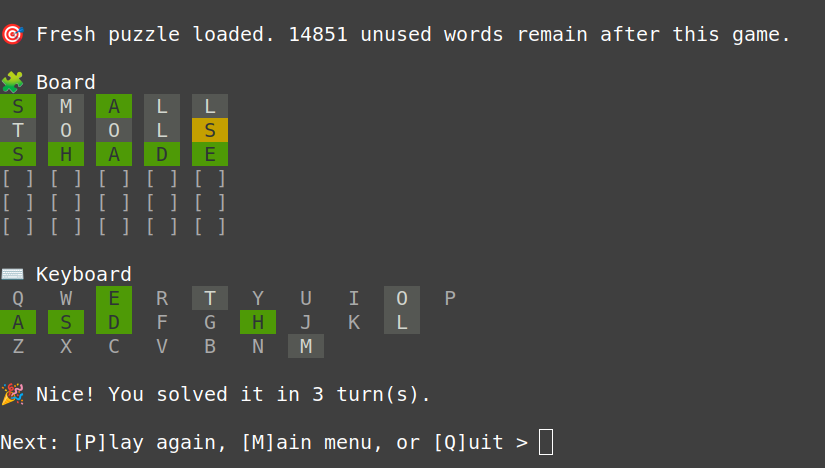
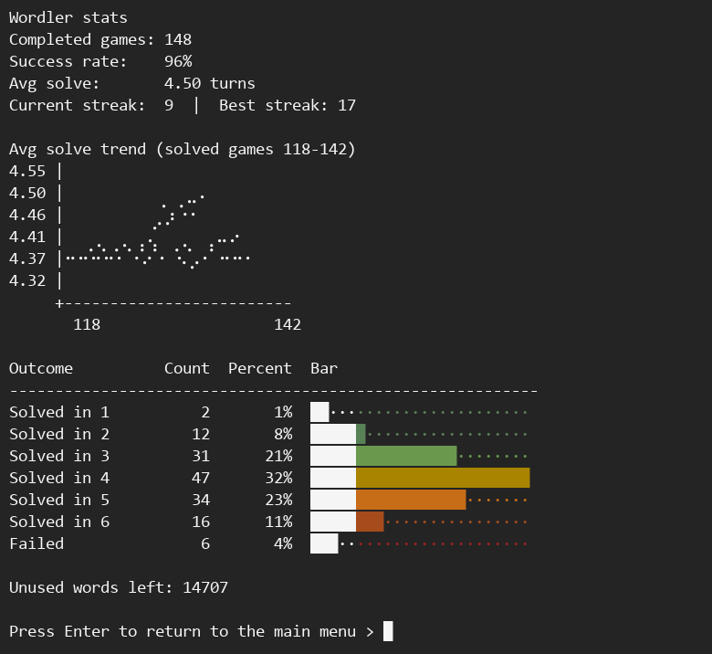

# Wordler (terminal Wordle clone)

Play Wordler directly in your terminal with persistent stats and non-repeating answers.

## Screenshots





## Quick start

```bash
python wordler.py
```

## Commands

```bash
python wordler.py
python wordler.py remaining
python wordler.py sync-words
```

Running `python wordler.py` opens an in-terminal menu where you can:

- Start a new game
- View stats
- View last 10 games
- Toggle hard mode
- Quit

## What it includes

- **Word repository:** `word_repository.txt` expanded from [`tabatkins/wordle-list`](https://github.com/tabatkins/wordle-list) (14,855 5-letter words), now stored as `word,score`
- **Clean terminal UI:** colored tiles, keyboard feedback, screen clearing between views, and redraws after each guess
- **Terminal navigation:** one command opens menu-driven navigation with clean transitions between game, stats, history, and menu screens
- **Number hotkeys in menus:** menu prompts use numbered options (main menu, settings, post-game actions)
- **Hard mode toggle:** optional rules enforce revealed hints on future guesses (green letters stay fixed; yellow hints must be reused)
- **Persistent tracking:** SQLite database at `.wordler/wordler.db`
- **No repetition:** once a word is used for a game, it is never reused
- **Guessability scoring:** each word has a 1-10 score; higher-scored words are more likely to be selected as answers
- **Stats view:** success rate plus bar-chart distribution and per-outcome percentages:
  - solved in 1
  - solved in 2
  - solved in 3
  - solved in 4
  - solved in 5
  - solved in 6
  - failed

## Notes

- Games ended early (Ctrl+C / `quit`) count as failed so the selected word still stays non-repeating.
- Guesses must be valid repository words; invalid guesses are rejected and do not consume a turn.
- End-of-game prompt lets you **play again**, return to **main menu**, or **quit**.
- Stats and history screens pause before returning to the main menu.
- Repository format supports either:
  - `word` (defaults score to 5)
  - `word,score` where score is an integer from 1 to 10
- Scores in the bundled repository are derived from English word-frequency (Zipf) scaling.
- Answers are sampled from unused words with score **5+** first, weighted toward higher scores.
- Add more words to `word_repository.txt`, then run:

```bash
python wordler.py sync-words
```

## License

MIT. See [LICENSE](LICENSE).
